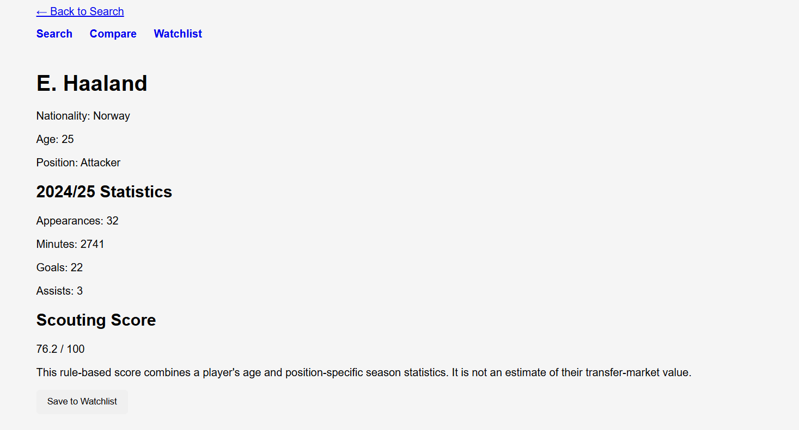
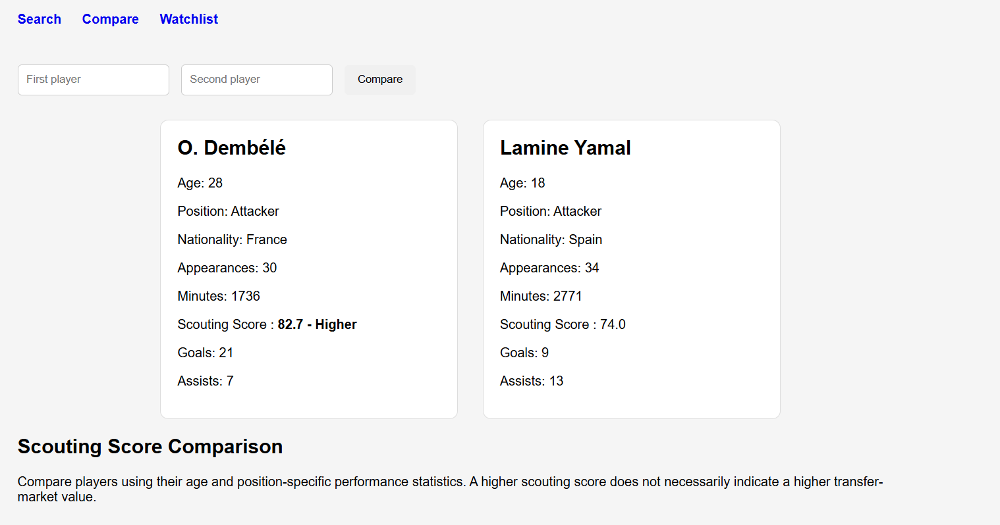
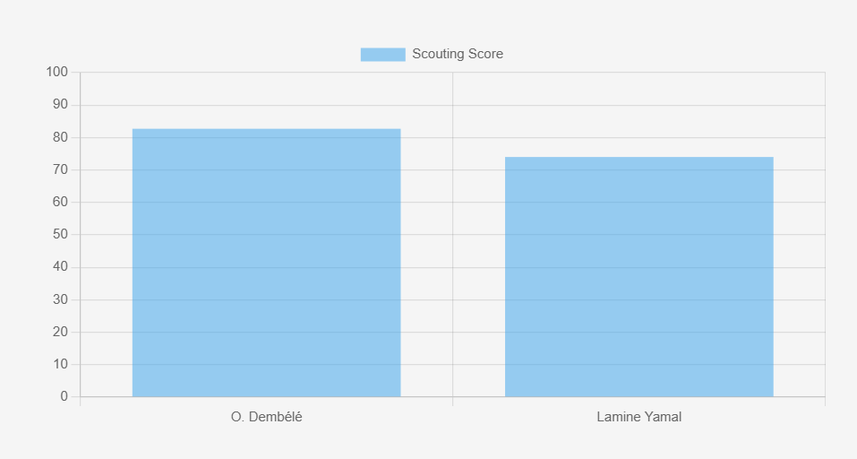
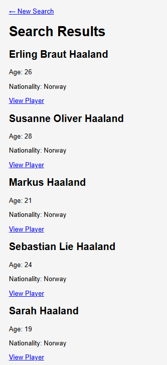
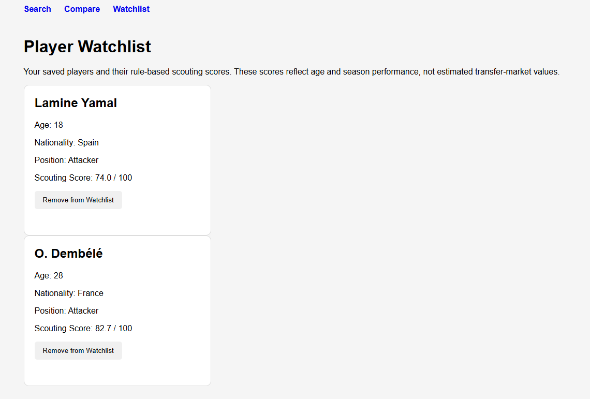

# Football Scouting & Player Analysis Platform

A full-stack football scouting application built with **Python and Flask** that allows users to search for football players, analyse season statistics, compare players and save them to a persistent watchlist.

The application integrates with the **API-Football REST API** and uses an explainable, position-specific algorithm to generate a **Scouting Score out of 100**, based on age and season performance.

The Scouting Score is a custom statistical assessment, not a prediction of a player's transfer-market value.

## Application Screenshots

### Player Profile and Scouting Score

View player information, season statistics and an explainable Scouting Score.



### Player Comparison

Compare two players side-by-side using position-specific performance statistics.



The application also uses Chart.js to visualise the difference between their Scouting Scores.



### Player Search

Search for players and select the correct result when multiple players have similar names.



### Persistent Watchlist

Save players to a SQLite database and revisit or remove them later.



## Why I Built This

I developed this project to combine my interest in football with software engineering and data-driven analysis.

I wanted to build an application that went beyond displaying API data by processing football statistics, implementing a custom scoring algorithm and allowing users to compare players.

The project gave me practical experience with backend development, REST API integration, database persistence and full-stack application development.

## Features

- Search for football players using API-Football
- Resolve ambiguous searches by selecting players using their unique IDs
- Display individual player profiles and season statistics
- Generate position-specific Scouting Scores
- Compare two players side-by-side
- Visualise Scouting Scores using Chart.js
- Save and remove players from a persistent SQLite watchlist
- Handle missing numerical statistics and unavailable player statistics
- Select a statistics entry when players appear across multiple teams or competitions

## Tech Stack

| Technology | Purpose |
|---|---|
| Python | Backend logic, data processing and scoring |
| Flask | Web application and routing |
| API-Football | External football player data |
| Requests | HTTP requests to the REST API |
| SQLite | Persistent player watchlist |
| HTML/CSS | User interface |
| Jinja2 | Dynamic HTML templates |
| Chart.js | Player comparison visualisation |
| python-dotenv | Environment-variable management |
| Git & GitHub | Version control |

## How the Application Works

1. A user searches for a football player.
2. Flask sends a request to the API-Football REST API.
3. Matching player profiles are displayed.
4. The user selects the correct player using their unique ID.
5. The application retrieves the player's statistics for the configured season.
6. Python processes the response and selects the statistics entry with the most minutes played.
7. Position-specific performance metrics are calculated.
8. The scoring algorithm combines age and performance into a Scouting Score.
9. The player's profile and statistics are displayed.

Users can also compare two players and save them to a persistent watchlist.

## Scouting Score

The application generates an explainable, rule-based Scouting Score from 0 to 100.

The scoring algorithm combines two components:

- **Age Score (40%)** — rewards younger players using predefined age brackets.
- **Performance Score (60%)** — evaluates position-specific season statistics using normalised, weighted metrics.

The final score is calculated as:

Scouting Score = (0.4 × Age Score) + (0.6 × Performance Score)

### Age Score

Players receive an age score based on predefined brackets:

| Age | Score |
|---|---:|
| Under 22 | 100 |
| 22–24 | 90 |
| 25–27 | 80 |
| 28–30 | 65 |
| 31 and above | 45 |

### Position-Specific Performance

Different positions are evaluated using different performance metrics.

**Attackers**

- Goals per 90 minutes
- Assists per 90 minutes
- Goal contributions per 90 minutes

**Midfielders**

- Assists per 90 minutes
- Key passes per 90 minutes
- Passes per 90 minutes
- Pass accuracy
- Duels won per 90 minutes

**Defenders**

- Tackles per 90 minutes
- Interceptions per 90 minutes
- Duels won per 90 minutes

The algorithm normalises these statistics against predefined thresholds and combines them using position-specific weights.

This allows players in different positions to be assessed using metrics relevant to their roles.

## Handling Real-World API Data

Working with external football data introduced several challenges.

**Missing statistics**

Some API responses contain missing numerical values. The application substitutes zero for supported missing statistical fields when calculating scores.

**Multiple competitions or teams**

A player may have several statistics entries for a season. The application selects the entry with the highest number of minutes played rather than combining statistics from every competition.

**Unavailable player statistics**

If the API returns no player statistics or no usable entry containing playing time, the application does not generate a player profile.

**Ambiguous player names**

When searches return multiple matching players, users can select the correct player using their unique API-Football ID.

These features required additional backend logic rather than assuming that every API response would contain complete, directly usable data.

## Player Comparison

Users can search for two players, select the correct profiles and compare their statistics.

The comparison displays:

- Age, nationality and position
- Appearances and minutes played
- Relevant position-specific statistics
- Scouting Scores

Chart.js generates a bar chart comparing the two players' Scouting Scores.

The comparison is intended to support statistical analysis. A higher score does not necessarily mean that a player is better overall or has a higher transfer-market value.

## Persistent Watchlist

The application uses SQLite to maintain a persistent player watchlist.

Saved records contain:

- Player ID
- Name
- Age
- Nationality
- Position
- Scouting Score

Users can add players, view their watchlist and remove players.

The saved score is a snapshot from when the player was added; the application does not automatically refresh saved records.

## Limitations

The Scouting Score is a manually designed measure of age and single-season statistical performance.

It is **not a trained machine-learning model or a transfer-price prediction**.

It does not currently incorporate several factors that may affect transfer-market value, including:

- Contract length and release clauses
- Transfer-market demand
- Commercial value
- Performance across multiple seasons
- Injury history
- Future potential beyond the age adjustment

The scoring weights and thresholds were chosen manually. They have not been validated against historical transfer prices or independent scouting assessments.

Comparisons between players in different positions should also be interpreted cautiously because different statistical metrics are used.

The application currently selects one statistics entry per player, so the displayed figures do not necessarily represent their combined performance across all competitions.

## Running the Project Locally

### 1. Clone the Repository

```bash
git clone https://github.com/paulwodi06-ui/football-scouting-platform.git
cd football-scouting-platform
```

### 2. Create a Virtual Environment

```bash
python -m venv venv
```

Activate the virtual environment.

On Windows PowerShell:

```powershell
.\venv\Scripts\Activate.ps1
```

On macOS or Linux:

```bash
source venv/bin/activate
```

### 3. Install Dependencies

```bash
pip install -r requirements.txt
```

### 4. Configure the API Key

Obtain an API key from API-Football:

https://www.api-football.com/

Create a `.env` file in the project root:

```env
API_KEY=your_api_football_key
```

Replace the placeholder with your own API key.

The `.env` file is excluded from Git and should never be committed.

The application currently requests API-Football's 2024 season data. Available players, competitions and requests depend on your API subscription.

### 5. Run the Application

```bash
python app.py
```

Open the following address in your browser:

http://127.0.0.1:5000

The SQLite watchlist database is initialised when the application starts.

The current Flask configuration uses debug mode and is intended for local development, not production deployment.

## Repository Structure

```text
football-scouting-platform/
├── app.py
├── requirements.txt
├── README.md
├── .gitignore
├── screenshots/
│   ├── player-profile.png
│   ├── player-comparison.png
│   ├── comparison-chart.png
│   ├── search-results.png
│   └── watchlist.png
├── static/
│   └── style.css
└── templates/
    ├── index.html
    ├── searchresults.html
    ├── player.html
    ├── compare.html
    └── watchlist.html
```

The local `.env` file, virtual environment and generated SQLite database are excluded from version control.

## Future Improvements

- [ ] Add automated tests using pytest
- [ ] Improve API error handling, including request timeouts and rate limits
- [ ] Refactor the Flask backend into smaller modules
- [ ] Add support for combining statistics across multiple competitions
- [ ] Extend player analysis across multiple seasons
- [ ] Explore training and evaluating a supervised market-value prediction model using historical data
- [ ] Deploy the application

## What I Learned

This project developed my understanding of full-stack software engineering by bringing together several components into one working application.

In particular, I gained experience with:

- Integrating external REST APIs into a Flask backend
- Processing real-world JSON data
- Designing and implementing a rule-based scoring algorithm
- Working with SQLite for persistent storage
- Building dynamic pages using Jinja2
- Visualising application data with Chart.js
- Debugging and handling incomplete statistical data
- Managing a project using Git and GitHub

It also highlighted the importance of distinguishing between implementing an algorithm and validating whether that algorithm measures its intended outcome.